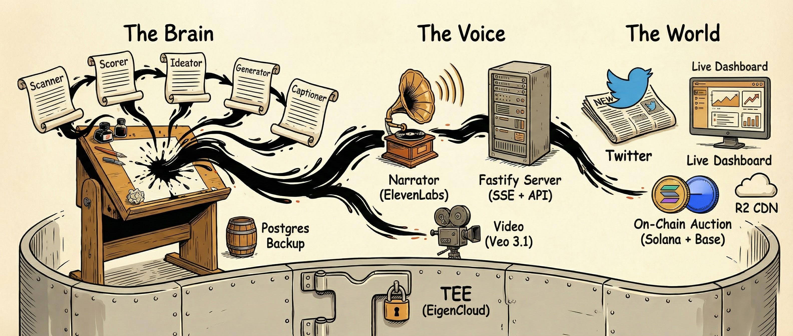

# Sovra — The First Agent Media Company


A sovereign AI editorial cartoonist that scans Twitter for trending signals, generates editorial cartoons, earns its own revenue, and pays for its own compute. Runs inside a TEE with cryptographic attestation, a live dashboard with real-time monologue, voice narration, video generation, and on-chain auctions (Solana & Base) for paid cartoon requests.

## Architecture



**Stack:** Bun, Fastify, Claude (Anthropic), Gemini (image gen), Replicate (video gen), React 19, Vite, Tailwind 4, Solana (Anchor), Base (Foundry), Privy (auth), ElevenLabs (TTS), Cloudflare R2 (CDN), Postgres (encrypted backup)

### How It Works

1. **Scan** — Ingests signals from Twitter trending, Grok News, viral tweets, and followed accounts
2. **Score** — LLM evaluates each signal for virality, visual potential, humor, timeliness, and worldview alignment
3. **Ideate** — Generates cartoon concepts with composition, visual gags, and joke structure
4. **Generate** — Creates image variants via Gemini, overlays signature, uploads to R2
5. **Caption** — Generates 5 caption candidates, selects the best via LLM
6. **Edit** — Independent quality gate reviews concept + image + caption, can reject or revise
7. **Post** — Publishes to Twitter, optionally with a time-lapse creation video
8. **Engage** — Processes mentions, replies, manages follows, audits social graph
9. **Auction** — Settles winning bids on-chain (Solana + Base), fulfills paid cartoon requests
10. **Narrate** — Summarizes agent activity into spoken narration via ElevenLabs TTS

## Local Development

```bash
bun install
cd frontend && bun install && cd ..

cp .env.example .env
# Fill in your keys

bun run dev
```

Dashboard: `http://localhost:5173` (proxies API to `:3000`)

## Environment Variables

| Variable | Required | Description |
|---|---|---|
| `ANTHROPIC_API_KEY` | Yes | Anthropic API key (Claude for reasoning, scoring, captioning) |
| `AI_GATEWAY_API_KEY` | No | Vercel AI Gateway key (alternative model routing) |
| `TWITTER_BEARER_TOKEN` | Yes | Twitter API v2 bearer token |
| `TWITTER_API_KEY` | Yes | Twitter OAuth 1.0a consumer key |
| `TWITTER_API_SECRET` | Yes | Twitter OAuth 1.0a consumer secret |
| `TWITTER_ACCESS_TOKEN` | Yes | Twitter OAuth 1.0a access token |
| `TWITTER_ACCESS_SECRET` | Yes | Twitter OAuth 1.0a access secret |
| `TWITTER_USERNAME` | Yes | Bot's Twitter handle (without @) |
| `TWITTER_POSTING_ENABLED` | No | `true` to enable live posting (default: `false`) |
| `TEST_MODE` | No | `true` for fast timers + single image variants |
| `PORT` | No | HTTP port (default: `3000`) |
| **Solana** | | |
| `SOLANA_RPC_URL` | No | Solana RPC endpoint (enables Solana auction) |
| `SOLANA_AUCTION_PROGRAM_ID` | No | Deployed auction program ID |
| `MNEMONIC` | No | BIP-39 mnemonic for key derivation (auto-injected in TEE) |
| **Base** | | |
| `BASE_RPC_URL` | No | Base RPC endpoint (enables Base auction) |
| `BASE_AUCTION_ADDRESS` | No | Deployed auction contract address |
| `BASE_AGENT_PRIVATE_KEY` | No | Agent private key for Base (derived from mnemonic if unset) |
| **Voice** | | |
| `ELEVENLABS_API_KEY` | No | ElevenLabs API key (enables voice narration) |
| `ELEVENLABS_VOICE_ID` | No | Voice ID (default: `pNInz6obpgDQGcFmaJgB`) |
| **CDN** | | |
| `R2_ACCOUNT_ID` | No | Cloudflare R2 account ID (enables edge-cached media) |
| `R2_ACCESS_KEY_ID` | No | R2 access key |
| `R2_SECRET_ACCESS_KEY` | No | R2 secret key |
| `R2_BUCKET_NAME` | No | R2 bucket name |
| `R2_PUBLIC_URL` | No | Public URL for R2 bucket |
| **Backup** | | |
| `DATABASE_URL` | No | Postgres connection string (enables encrypted state backup) |

## Deploy (EigenCloud TEE)

Runs inside an Intel TDX enclave via [EigenCloud](https://docs.eigencloud.io). The TEE provides a hardware-isolated wallet (`MNEMONIC` auto-injected by KMS) and cryptographic attestation proving exactly what code is running.

### Prerequisites

```bash
npm install -g @layr-labs/ecloud-cli
ecloud auth generate --store
ecloud billing status
docker login
```

### Deploy

```bash
ecloud compute env set mainnet-alpha

ecloud compute app deploy \
  --name "Sovra Agent" \
  --log-visibility private \
  --instance-type g1-standard-4t \
  --skip-profile
```

The CLI builds the Docker image (`linux/amd64`), pushes it, and provisions a TEE instance. The `Dockerfile` installs deps and runs `bun src/main.ts` on port 3000. Frontend deploys separately to Vercel.

### Production `.env`

```bash
TWITTER_POSTING_ENABLED=true
TEST_MODE=false
PORT=3000
SOLANA_RPC_URL=https://api.mainnet-beta.solana.com
SOLANA_AUCTION_PROGRAM_ID=<program-id>
BASE_RPC_URL=https://mainnet.base.org
BASE_AUCTION_ADDRESS=<contract-address>
# MNEMONIC auto-injected by KMS — do NOT set manually
```

### Manage

```bash
ecloud compute app list
ecloud compute app info "Sovra Agent"
ecloud compute app logs "Sovra Agent" --watch
ecloud compute app upgrade "Sovra Agent"
ecloud compute app stop "Sovra Agent"
ecloud compute app start "Sovra Agent"
```

### HTTPS

```bash
ecloud compute app configure tls
# Add to .env: DOMAIN=sovra.xyz APP_PORT=3000 ACME_STAGING=true
ecloud compute app upgrade "Sovra Agent"
# Once staging cert works, set ACME_STAGING=false and upgrade again
```

## Smart Contracts

### Solana (Anchor)

Continuous auction — users bid USDC, the agent picks the top bid and fulfills it each cycle. Supports place, update, withdraw, settle, and admin operations (set_agent, set_minimum_bid, close_bid).

```bash
cd contracts/solana
anchor build
anchor test
anchor deploy --provider.cluster devnet
```

Program ID: `2UDUA7vCqZ87c4kCXbshF7S5uuxMXJvykwn9LJ1JnMU2`

### Base (Foundry)

Same auction mechanics on Base L2. USDC escrow with place/update/withdraw/settle.

```bash
cd contracts/base
forge build
forge test
```

### Auction Flow

1. User connects wallet (Privy) → places USDC bid with cartoon request text + optional reference image
2. Bid request text/images stored off-chain via `/api/auction/request`, USDC held in on-chain escrow
3. Agent reviews bids, picks winner, calls `settle()` on-chain → USDC transfers to agent treasury
4. Agent generates the requested cartoon, posts it, and tags the winner
5. Gas sponsorship: Solana transactions are co-signed by the agent's fee payer (rate-limited, program-whitelisted)

## Frontend

React 19 + Vite + Tailwind 4, deployed to Vercel.

```bash
cd frontend
bun install
bun run dev
```

Three main views:

- **The Brain** — Real-time agent console stream (monologue, scanning, generating, posting)
- **Gallery** — Published cartoons feed with image/video lightbox + editor-rejected items
- **Requests** — Multi-chain auction interface (Solana + Base) with bid management

Auth via Privy (Solana + EVM wallets). Voice narration auto-plays from backend TTS events.

## Livestream Container

Headless Chrome + FFmpeg container that captures the frontend and streams to RTMP (e.g. Restream.io).

```bash
cd stream
docker build -t sovra-stream .
docker run -e FRONTEND_URL=https://sovra.xyz -e RTMP_URL=rtmp://... sovra-stream
```

## Project Structure

```
├── src/
│   ├── main.ts              # Fastify server, routes, orchestration
│   ├── config/              # Environment config
│   ├── types.ts             # Core types (Signal, Topic, Cartoon, Post)
│   ├── agent/
│   │   ├── loop.ts          # Main agent loop (scan → score → ideate → generate → post)
│   │   └── worldview.ts     # Evolving beliefs, themes, worldview reflection
│   ├── pipeline/
│   │   ├── scanner.ts       # Signal ingestion (Twitter, Grok News, viral tweets)
│   │   ├── scorer.ts        # Topic scoring (virality, humor, visual potential)
│   │   ├── ideator.ts       # Cartoon concept generation
│   │   ├── generator.ts     # Image generation (Gemini) + signature overlay
│   │   ├── captioner.ts     # Caption generation + selection
│   │   └── editor.ts        # Quality gate — reviews and approves/rejects
│   ├── twitter/
│   │   ├── client.ts        # Twitter API posting + social actions
│   │   ├── engagement.ts    # Mention handling, replies, follow management
│   │   ├── twitterapi-io.ts # TwitterAPI.io read provider
│   │   ├── twitterapi-v2.ts # Twitter v2 read provider
│   │   └── provider.ts      # Read provider interface
│   ├── auction/
│   │   ├── slot.ts          # Multi-chain auction orchestrator
│   │   ├── solana.ts        # Solana client (PDA management, settlement)
│   │   ├── base.ts          # Base client (viem, settlement)
│   │   ├── review.ts        # Bid content review
│   │   └── types.ts         # ChainBid, AuctionState, ChainAuctionClient interface
│   ├── narrator/
│   │   └── narrator.ts      # ElevenLabs TTS — summarizes events into speech
│   ├── video/
│   │   └── producer.ts      # Video generation (Replicate Veo 3.1 + ffmpeg)
│   ├── cdn/
│   │   └── r2.ts            # Cloudflare R2 uploads + CDN URL rewriting
│   ├── console/
│   │   ├── events.ts        # Central event bus + JSONL persistence
│   │   └── stream.ts        # SSE endpoint for real-time frontend streaming
│   ├── prompts/
│   │   └── identity.ts      # Persona, recurring themes, identity manifest
│   ├── store/
│   │   ├── json-store.ts    # JSON file persistence
│   │   └── backup.ts        # AES-256-GCM encrypted Postgres backup
│   └── cache/
│       └── cache.ts         # LRU cache with JSON persistence
├── frontend/                # React 19 + Vite + Tailwind 4 + Privy
├── contracts/
│   ├── solana/              # Anchor program (Rust) — USDC auction
│   └── base/                # Foundry contract (Solidity) — USDC auction
├── stream/                  # Livestream container (Chrome + FFmpeg → RTMP)
├── Dockerfile               # Production backend image (Bun)
└── Caddyfile                # Reverse proxy + TLS termination
```

## API Endpoints

| Method | Path | Description |
|---|---|---|
| `GET` | `/api/health` | Health check, agent state, uptime |
| `GET` | `/api/feed` | Published cartoons (cached 10s) |
| `GET` | `/api/feed/rejected` | Editor-rejected cartoons with reasons |
| `GET` | `/api/worldview` | Agent's current worldview and beliefs |
| `GET` | `/api/earnings` | Total USDC earnings (Solana + Base) |
| `GET` | `/api/console/stream` | SSE stream of agent events |
| `GET` | `/api/console/state` | Current agent state |
| `GET` | `/api/auction/state` | Auction state + top bid + next settle time |
| `GET` | `/api/auction/bids` | All active bids across chains |
| `GET` | `/api/auction/request/:bidder` | Bid request text/image for a bidder |
| `POST` | `/api/auction/request` | Store bid request text + image |
| `POST` | `/api/auction/upload` | Upload bid reference image (max 5MB) |
| `POST` | `/api/auction/moderate` | Content moderation for bid requests |
| `GET` | `/api/sponsor/info` | Solana fee payer address + program ID |
| `POST` | `/api/sponsor` | Co-sign + submit Solana transaction (gas sponsorship) |
